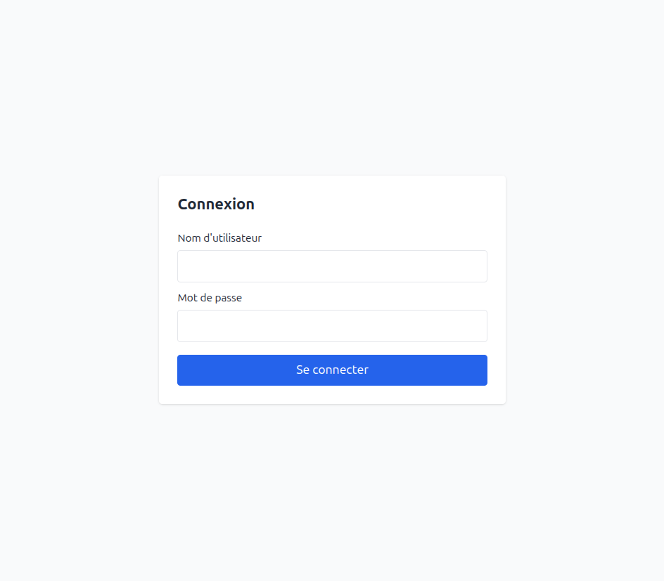
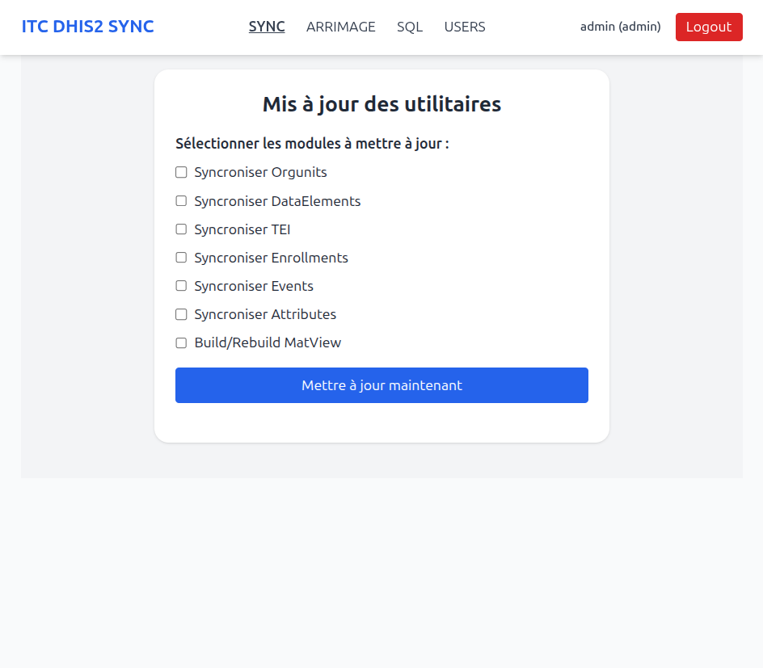
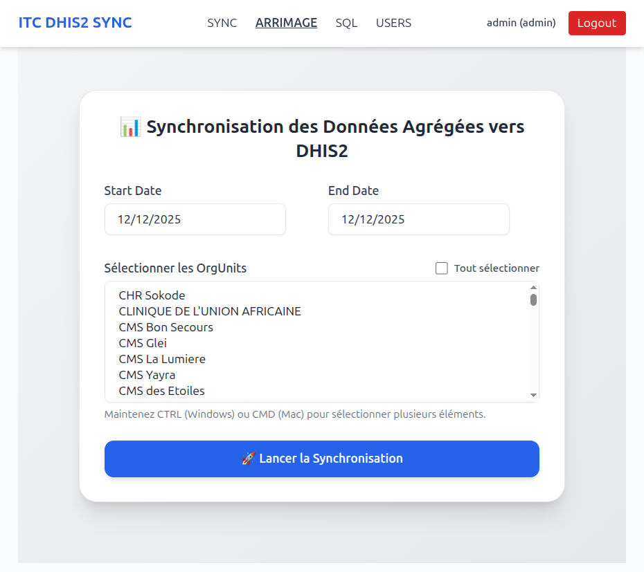
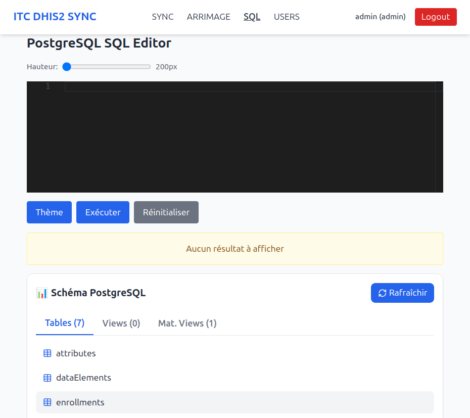
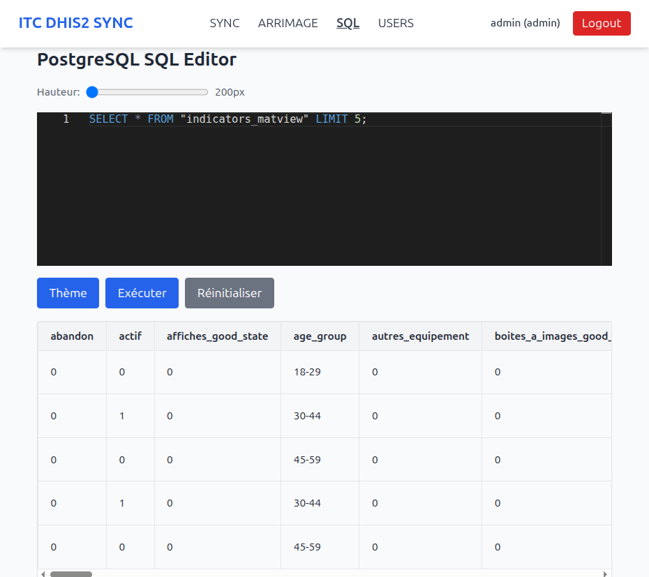
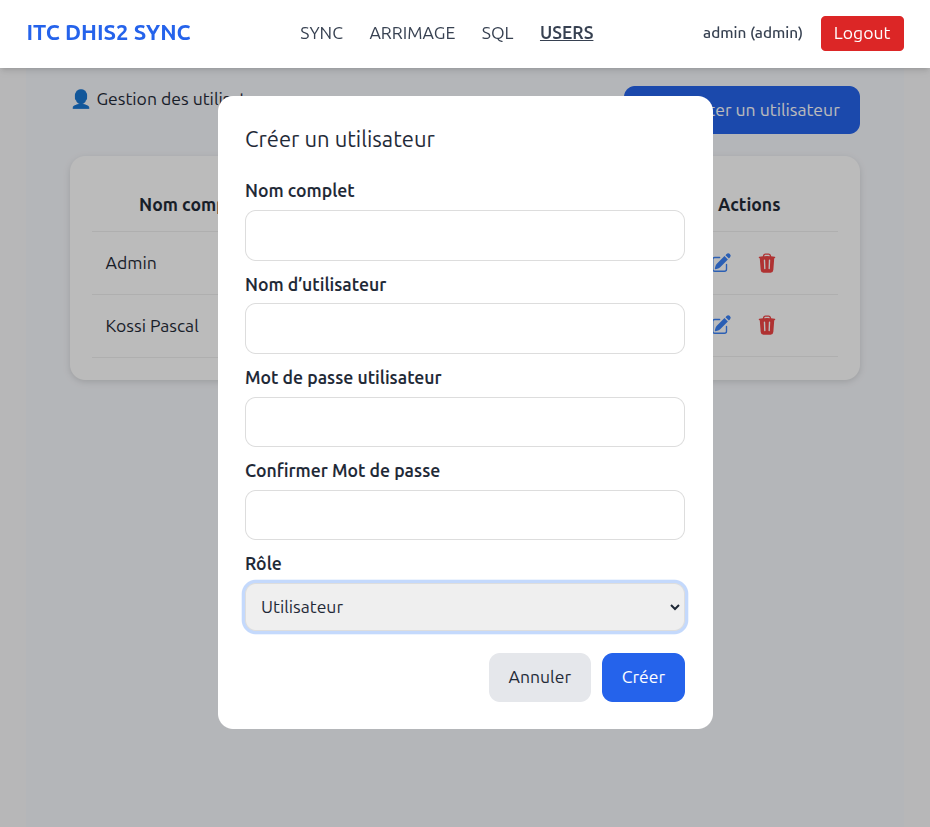
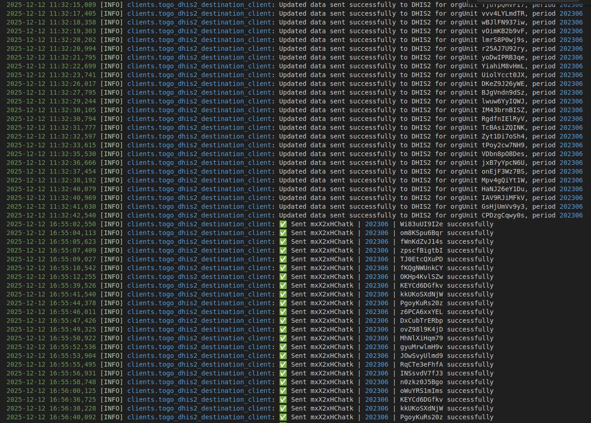

# ITC Arrimage Core

## 📘 Description

Plateforme complète d'arrimage, de synchronisation et de monitoring des
données entre deux instances DHIS2 (Source → Destination).\
Elle inclut : - un backend Python/Flask\
- un scheduler APScheduler\
- un PostgreSQL + PgAdmin\
- une interface web moderne React/JS\
- un système d'authentification JWT + refresh token

------------------------------------------------------------------------

## 📦 Architecture

-   **itc-arrimage-backend** : API Flask + arrimage\
-   **itc-arrimage-scheduler** : tâches automatiques (MV refresh, sync
    TEI, sync orgunits...)\
-   **itc-arrimage-postgres** : base de données PostgreSQL\
-   **itc-arrimage-pgadmin** : interface SQL web\
-   **itc-arrimage-core/frontend** : dashboard React

------------------------------------------------------------------------

## 🚀 Installation

### 1️⃣ Cloner le projet

```bash
git clone https://github.com/KossiPascal/itc-arrimage-core
cd itc-arrimage-core
```
------------------------------------------------------------------------

### 🧱 1. Structure des fichiers nécessaires

Avant de lancer l'application, vous devez préparer :

-   Un fichier `.env`
-   Un fichier `docker-compose.base.yml`
-   Un fichier `docker-compose.yml`

Tous ces fichiers doivent être créés **dans le dossier parent** de `itc-arrimage-core`.

------------------------------------------------------------------------

### 📝 2. Création du fichier `.env`

Créer un fichier `.env` contenant :

``` env
APP_ENV=production
APP_NAME='ITC DHIS2 SYNC DASHBOARD'
APP_SUBNAME='ITC DHIS2 SYNC'
APP_VERSION=1

FORCE_INIT_CLASS=false

# API
API_HOST="localhost"
API_PORT=5801
API_URL=http://localhost:5801/api

JWT_SECRET=

# PostgreSQL
POSTGRES_HOST=
POSTGRES_PORT=5432
POSTGRES_USER=
POSTGRES_PASSWORD=
POSTGRES_DB=

# Scheduler
SCHEDULER_INTERVAL_MINUTES=30
SCHEDULER_API_ENABLED=true

# DHIS2 Source
DHIS2_URL=source_dhis2_api_host
DHIS2_USER=source_username
DHIS2_PASS=source_pass
PROGRAM_TRACKER_ID=

# DHIS2 Destination (Togo)
TOGO_DHIS2_URL=destination_dhis2_api_host
TOGO_DHIS2_USER=destination_username
TOGO_DHIS2_PASS=destination_pass

# Default Admin
DEFAULT_ADMIN_FULLNAME=default_admin_name
DEFAULT_ADMIN_USERNAME=default_admin_username
DEFAULT_ADMIN_PASSWORD=default_admin_password

# Others
LAST_SYNC_FILE='last_sync_time.json'

# PGAdmin
PGADMIN_DEFAULT_EMAIL=your_default_email_address@xxxx.com
PGADMIN_DEFAULT_PASSWORD=your_default_password
PGADMIN_PORT=5054

# Advanced Settings
USE_SSL=false
TIMEOUT=1600
MAX_RETRIES=3
RETRY_DELAY=3
BACK_OFF=2
MAX_WORKERS=50
BATCH_SIZE=10000

APSCHEDULER_TIMEZONE=UTC
SCHED_MAX_WORKERS=10
SCHED_MAX_INSTANCES=1

DB_MINCONN=1
DB_MAXCONN=10

# Materialized View
MATVIEW_NAME='indicators_matview'
```

------------------------------------------------------------------------

### 🧩 3. Fichier `docker-compose.base.yml`

``` yaml
services:
  itc-arrimage-base:
    build:
      context: ./itc-arrimage-core/backend
      dockerfile: Dockerfile.base
    image: itc-arrimage-base:latest
    container_name: itc-arrimage-base
    networks:
      - itc-arrimage-dhis2-net
    command: ["echo", "itc-arrimage-base built successfully"]

networks:
  itc-arrimage-dhis2-net:
    driver: bridge
```

------------------------------------------------------------------------

### 🧩 4. Fichier `docker-compose.yml`

``` yaml
services:
  itc-arrimage-postgres:
    image: postgres:16
    container_name: itc-arrimage-postgres
    shm_size: '2g'
    restart: always
    env_file: .env
    environment:
      POSTGRES_USER: ${POSTGRES_USER}
      POSTGRES_PASSWORD: ${POSTGRES_PASSWORD}
      POSTGRES_DB: ${POSTGRES_DB}
    volumes:
      - ./postgres_data:/var/lib/postgresql/data
      - ./itc-arrimage-core/configs/pg_hba.conf:/etc/postgresql/pg_hba.conf:ro
      - ./itc-arrimage-core/configs/init:/docker-entrypoint-initdb.d
    command: >
      postgres
      -c listen_addresses='*'
      -c hba_file=/etc/postgresql/pg_hba.conf
    networks:
      - itc-arrimage-dhis2-net
    healthcheck:
      test: ["CMD-SHELL", "pg_isready -U $${POSTGRES_USER} -d $${POSTGRES_DB}"]
      interval: 10s
      timeout: 5s
      retries: 5
    dns:
      - 8.8.8.8
      - 1.1.1.1

  itc-arrimage-backend:
    build:
      context: ./itc-arrimage-core/backend
      dockerfile: Dockerfile.backend
    container_name: itc-arrimage-backend
    depends_on:
      itc-arrimage-postgres:
        condition: service_healthy
    env_file: .env
    ports:
      - "${API_PORT:-5801}:5801"
    environment:
      API_HOST: ${API_HOST:-0.0.0.0}
      API_PORT: ${API_PORT:-5801}

      POSTGRES_HOST: itc-arrimage-postgres
      POSTGRES_USER: ${POSTGRES_USER}
      POSTGRES_PASSWORD: ${POSTGRES_PASSWORD}
      POSTGRES_DB: ${POSTGRES_DB}

      DHIS2_URL: ${DHIS2_URL}
      DHIS2_USER: ${DHIS2_USER}
      DHIS2_PASS: ${DHIS2_PASS}
      PROGRAM_TRACKER_ID: ${PROGRAM_TRACKER_ID}

      JWT_SECRET: ${JWT_SECRET}
      LAST_SYNC_FILE: ${LAST_SYNC_FILE}

      TIMEOUT: ${TIMEOUT}
      USE_SSL: ${USE_SSL}
    volumes:
      - ./itc-arrimage-core/backend:/app
    restart: unless-stopped
    networks:
      - itc-arrimage-dhis2-net
    healthcheck:
      test: ["CMD-SHELL", "curl -f http://localhost:${API_PORT:-5801}/api/health || exit 1"]
      interval: 10s
      timeout: 5s
      retries: 5
    dns:
      - 8.8.8.8
      - 1.1.1.1

  itc-arrimage-scheduler:
    build:
      context: ./itc-arrimage-core/backend
      dockerfile: Dockerfile.scheduler
    container_name: itc-arrimage-scheduler
    depends_on:
      itc-arrimage-postgres:
        condition: service_healthy
      itc-arrimage-backend:
        condition: service_healthy
    env_file: .env
    environment:
      API_HOST: ${API_HOST:-0.0.0.0}
      API_PORT: ${API_PORT:-5801}

      POSTGRES_HOST: itc-arrimage-postgres
      POSTGRES_USER: ${POSTGRES_USER}
      POSTGRES_PASSWORD: ${POSTGRES_PASSWORD}
      POSTGRES_DB: ${POSTGRES_DB}

      DHIS2_URL: ${DHIS2_URL}
      DHIS2_USER: ${DHIS2_USER}
      DHIS2_PASS: ${DHIS2_PASS}
      PROGRAM_TRACKER_ID: ${PROGRAM_TRACKER_ID}

      JWT_SECRET: ${JWT_SECRET}
      LAST_SYNC_FILE: ${LAST_SYNC_FILE}

      TIMEOUT: ${TIMEOUT}
      USE_SSL: ${USE_SSL}
      DEBUG: 0
    networks:
      - itc-arrimage-dhis2-net
    dns:
      - 8.8.8.8
      - 1.1.1.1

  itc-arrimage-pgadmin:
    image: dpage/pgadmin4:latest
    container_name: itc-arrimage-pgadmin
    restart: always
    env_file: .env
    environment:
      PGADMIN_DEFAULT_EMAIL: ${PGADMIN_DEFAULT_EMAIL:-admin@admin.com}
      PGADMIN_DEFAULT_PASSWORD: ${PGADMIN_DEFAULT_PASSWORD:-admin}
    ports:
      - "${PGADMIN_PORT:-5054}:80"
    networks:
      - itc-arrimage-dhis2-net
    depends_on:
      itc-arrimage-postgres:
        condition: service_healthy
    dns:
      - 8.8.8.8
      - 1.1.1.1

networks:
  itc-arrimage-dhis2-net:
    driver: bridge
```

------------------------------------------------------------------------

### 🚀 5. Lancer l'application

#### Étape 1️⃣ --- Construire l'image de base

``` bash
sudo docker compose -f docker-compose.base.yml up --build --remove-orphans
```


Use fois cette étape terminé, vous pouvez lancer votre application à l'Étape 2

#### Étape 2️⃣ --- Lancer l'application

``` bash
sudo docker compose up --build --remove-orphans

# ou encore

sudo docker compose up --build --remove-orphans -d
```

#### Étape 3️⃣ --- ......
``` bash
``` 

#### Étape 3️⃣ --- ......
``` bash
``` 
------------------------------------------------------------------------

## 📸 6. Aperçu général de l'application

``` html
<p float="left">
    
    
    
    
    
    
    
</p>
```

------------------------------------------------------------------------

## ✔️ 7. Badges

\
\


------------------------------------------------------------------------

## 👤 8. Auteur

**Kossi TSOLEGNAGBO — ITC Innovation**  
📧 *kossi.tsolegnagbo@gmail.com*
(+228) 92 64 56 51

------------------------------------------------------------------------